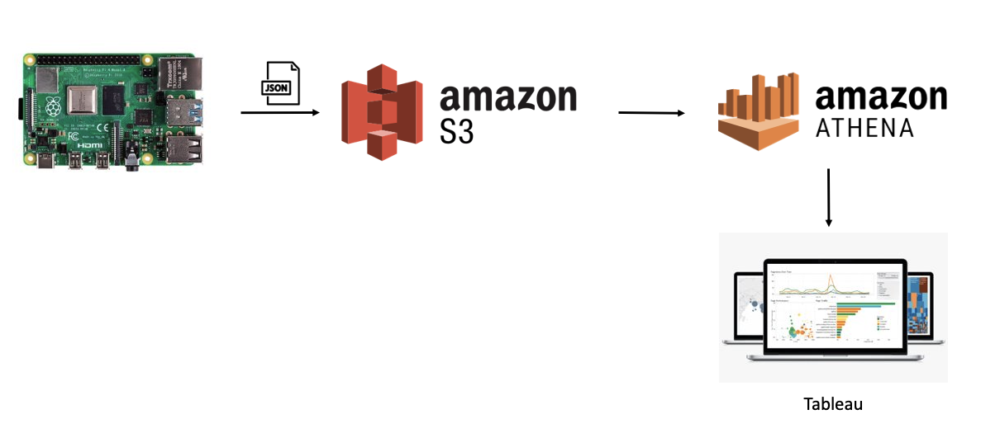
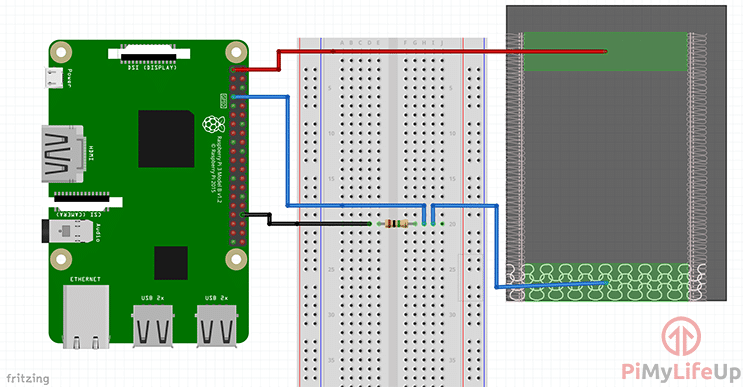

# Health Tracker Dashboard

## Scope

Creating a dashboard to track and monitor a certain health condition. We will do this by monitoring the times at which a pressure plate is pressed. It is useful for the doctor to know the frequency at which this plate is pressed as well as the times of day it is pressed.

A Raspberry Pi will be used to monitor the pressure plate and send logs to S3 where Athena will be used for querying. Visualizations will be made with Tableau.

## Flowchart

## Raspberry Pi Setup

The Raspberry Pi is constantly monitoring the state of the pressure plate. When pressed, the RPi will log the starting timestamp. Once the plate is let go, the RPi will log the ending timestamp and send these two values in the form of a JSON file to S3. Example: `{"start_ts": "2022-10-29 23:48:53.957035", "end_ts": "2022-10-29 23:53:09.575207"}`
